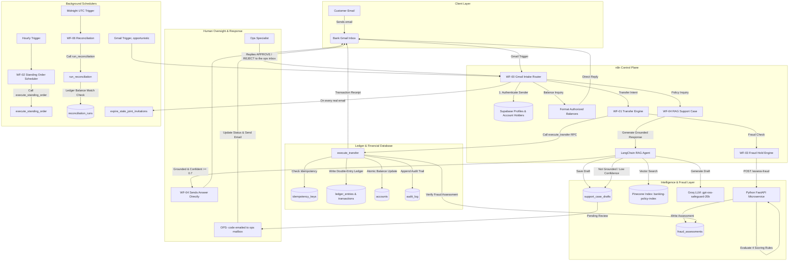

# Autonomous Digital Banking & AI Automation Platform

[](https://n8n.io/)
[](https://supabase.com/)
[](https://fastapi.tiangolo.com/)
[](https://python.langchain.com/)
[](https://www.pinecone.io/)
[](https://groq.com/)

> **An event-driven, production-grade automated digital banking control plane.**  
> Processes real customer email inquiries, executes zero-trust double-entry financial transactions via strict PostgreSQL database RPCs, computes real-time fraud risk scores via a dedicated FastAPI microservice, and grounds customer support inquiries using RAG — sending confident, well-grounded answers directly, and escalating only genuinely ambiguous ones to a human operator.

---

## 🏛️ Executive Summary

Modern banking demands seamless email interaction without sacrificing financial integrity or regulatory security. This project implements a **zero-trust automated core banking platform** where **n8n Cloud** acts as the orchestration control plane, **Supabase PostgreSQL** enforces immutable transactional ledger logic, a **Python FastAPI service** evaluates deterministic fraud risk scores, and a **LangChain RAG pipeline (Groq + Pinecone + Gemini)** drafts policy support responses.

### 🔑 Core Architectural Philosophy
1. **Zero-Trust Money Movement**: AI and n8n *never* mutate account balances or insert ledger lines directly. All financial transactions, balance checks, holds, and idempotency validations are strictly encapsulated inside atomic PostgreSQL `SECURITY DEFINER` functions (RPCs).
2. **Deterministic Fraud Boundaries**: High-risk transactions trigger automated account freezes before ledger execution based on velocity, amount, and recipient history.
3. **Grounded-First RAG, Human-in-the-Loop for the Rest**: a policy answer the model is confidently grounded on (`grounded=true`, `confidence >= 0.7`) is sent directly. Anything else is saved to an internal approval queue (`support_case_drafts`) and requires explicit human operator validation before it ever reaches a customer.

> 📋 **This capstone is graded on justified engineering judgment, not just working code.** [`docs/decisions.md`](docs/decisions.md) walks through all 32 edge cases from the assignment brief — what's built, what's deliberately scoped out, and the reasoning for each call. See the doc's **Session 2 Addendum** for self-service + joint account opening, either-or vs. both-signature transfer authority, majority-vote governance, minor/guardian accounts, and a public (non-customer) RAG chatbot — all added after the initial audit.

> 💱 **Currency: PKR (Pakistani Rupees).** All accounts, transfers, standing orders, and fraud thresholds are denominated in PKR; amounts are stored as `BIGINT` paisa (1 PKR = 100 paisa), the same integer-minor-unit design the schema always used for USD cents. A handful of legacy `$`/USD examples remain further down this README from before the currency switch — the live system and every current code path use PKR.

---

## 📊 Deployment & Implementation Matrix

| Component / Layer | Implementation Status | Deployment Environment | Live / Active Target |
|---|---|---|---|
| **Bank Gmail Intake** | ✅ Implemented | Live Google Workspace / Gmail | Shared privately with evaluators — see "Live Demo & Judge Testing Guide" |
| **n8n Orchestration Plane** | ✅ Implemented | n8n Cloud | 7 of 9 workflows active. WF-05 is **retired** (superseded by the `OPS-` email gate); WF-08 is deactivated (folded into WF-00). |
| **Financial Database & Ledger** | ✅ Implemented | Supabase Cloud PostgreSQL | 27 tables + 70 `SECURITY DEFINER` RPCs, currency: PKR |
| **Fraud Scoring Engine** | ✅ Implemented | Python FastAPI Microservice | `POST /assess-fraud` — deterministic, 4 rules |
| **Interest, Statements & Reconciliation** | ✅ Implemented | Python FastAPI Microservice | `/accrue-interest`, `/project-interest`, `/generate-statement`, `/reconcile` |
| **Reversals & Debt Tracking** | ✅ Implemented | Supabase RPCs + WF-06 | Chargeback with partial clawback; shortfall booked as a receivable, never a negative balance |
| **Disputes** | ✅ Implemented | n8n (WF-00) + Supabase | Unilateral to raise, co-holder input collected, always resolved by a human |
| **Self-Service Account Opening** | ✅ Implemented | n8n (WF-00) + Supabase Auth Admin API | Single, joint and guardian-supervised minor accounts; date of birth required |
| **Joint Account Invitations** | ✅ Implemented | n8n (WF-00, WF-08) + Supabase | 5-minute accept/decline window, auto-expiry |
| **Money-In: Deposits & Loans** | ✅ Implemented | n8n (WF-00) + Supabase Treasury account | Self-service deposits (capped), loans ≤ Rs 200k instant, ≤ Rs 2M human-reviewed |
| **Public RAG Support Chatbot** | ✅ Implemented | n8n (WF-04) | Answers anyone, not just customers |
| **Policy RAG Vector Search** | ✅ Implemented, seeded & verified | Pinecone Vector Database | `banking-policy-index` (3072-dim). Namespaces: **`banking_policy_v2` (live, fed from Google Drive)**, `banking_policy` (rollback target), `fraud_patterns` (10 typologies) — see [`docs/policy-documents/`](docs/policy-documents/) |
| **Bank Staff & Operations Roles** | ✅ Implemented | Supabase `bank_staff` + n8n (WF-00) | Staff are identified from the database, never a hardcoded address. An **administrator** alone can credit an account or admit a new operator; operators decide loans, resolve disputes and answer approvals. Joining is by pass phrase and requires administrator approval; a customer address can never be staff. |
| **LLM Support Drafting** | ✅ Implemented | Groq Cloud | `openai/gpt-oss-safeguard-20b` |
| **Text Embeddings Engine** | ✅ Implemented | Google Gemini API | `gemini-embedding-001` |
| **Human Approval Queue** | ✅ Implemented | Dedicated ops Gmail inbox | An operator replies `APPROVE` / `REJECT` to an email carrying an `OPS-` code, or sends the code in a fresh message. `list pending approvals` returns the queue when an alert email goes astray. The old `/webhook/approve-draft` and `/webhook/approve-loan` endpoints are **retired**, not a fallback. |

---

## 🏗️ End-to-End System Architecture



> Human review is the exception path, not the default — see "RAG Policy Support Engine & Human Approval" below.

---

## ⚡ Core Banking & Business Rules

### 1. Atomic Double-Entry Financial Ledger
* All financial transactions create **exactly two ledger entries** (`ledger_entries`): one debit (`DEBIT`) and one credit (`CREDIT`), linked to a single transaction record (`transactions`).
* Account balances in `accounts.balance` are cached counters updated exclusively by `SECURITY DEFINER` SQL functions.
* All financial amounts are stored as **64-bit integers (`BIGINT`) representing paisa** (e.g., `Rs 50.00` = `5000` paisa; 1 PKR = 100 paisa) to prevent floating-point rounding errors.

### 2. Idempotency Gatekeeping
* Every financial transfer requires a unique `idempotency_key`.
* `idempotency_keys` uses an atomic `INSERT ON CONFLICT DO NOTHING` design.
* Duplicate incoming requests return the stored historical execution result without re-executing money movement.

### 3. Joint Accounts & Multi-Signatory Governance
* Accounts can have multiple profile associations via `account_holders` with roles (`primary`, `joint`) and holder types (`adult`, `minor`, `guardian`).
* **Mandate.** Every account carries an `authority_model`: `either_or` (any holder acts alone) or `all_signatures` (every holder must approve each transfer). The customer chooses it in plain English when they invite someone — *"both of us must approve"* or *"either of us can act alone"* — and `initiate_transfer()` enforces it. An `all_signatures` transfer is parked as a `joint_account_actions` row and every other holder is emailed a `JNT-XXXXXXXX` code they reply **APPROVE** or **REJECT** to.
* **Closure** requires explicit consent recorded in `joint_account_actions` and `joint_account_consents` — unanimous by default, or `floor(n/2)+1` when the account's `closure_authority` is `majority` and it has 3 or more holders.
* Nothing is marked approved until the action it authorises has actually succeeded; a signed transfer that then fails (insufficient funds, frozen account) stays pending with its error recorded, rather than looking approved with no money moved.

### 3b. Minor & Guardian Accounts
* Account opening asks for a **date of birth** and stores it. No date of birth, no account.
* An applicant under 18 cannot open an account alone. They must name a parent or guardian, who receives a `MIN-XXXXXXXX` code by email explaining exactly what approving means, and replies **APPROVE** or **REJECT**.
* On approval the account is created with the minor as `primary`/`minor` and the guardian as `joint`/`guardian`. The minor can check the balance and receive money; **only the guardian can move money out**, enforced by `is_holder_transfer_authorized()` inside `initiate_transfer()` — not by a workflow node. A minor holder also cannot take out a loan.
* `promote_minors_to_adult()` runs nightly in WF-06 and converts the holder to full adult access on their 18th birthday.

### 3c. Closing an Account
* An account is closed only when its balance is exactly **Rs 0.00** and it has no active holds, no active standing orders paying out of it, and no outstanding or pending loan. Each blocker is reported in plain language with the amount or count involved, up front, before anything is created.
* **Closure is irreversible and is never acted on from a single email.** Every holder of the account — *including the person who asked* — must confirm by replying `APPROVE` to an emailed `JNT-XXXXXXXX` reference code. On a joint account a single `REJECT` from any holder stops it; an unanswered request expires after 7 days and the account stays open.
* A minor on a guardian-supervised account cannot request closure; the guardian must.

### 3d. Removing a Holder, and Changing the Mandate
* **Removing a joint holder requires every holder to agree, including the person being removed.** You cannot be ejected from an account you are liable for without consenting, and you cannot walk away from one unilaterally either.
* Refused outright while the account carries an outstanding loan or an active hold — you cannot shrink the set of people answerable for a debt — or if it would leave the account with no holders at all (close it instead), or strip the guardian off an account a minor still holds.
* **Adding a holder discloses what they are inheriting.** Active holds, outstanding loan balance and unpaid debt are all stated in the approval request, and **the person being added must accept too**, not just the existing holders. Joint liability is not something other people can sign you up for.
* The transfer mandate and the closure rule can both be changed after opening, by unanimous consent. Majority closure is refused below three holders, because with two it is arithmetically identical to unanimous and would only mislead.

### 3e. Reversals, Chargebacks and Debt
* There is **no automated reversal**. A completed transfer is only ever reversed through a human decision — an upheld dispute, or an ops-approved reversal.
* A reversal claws back whatever the recipient still holds, through the same double-entry primitive as any other transfer.
* **If the money is already spent, the shortfall becomes an explicit debt, not a negative balance.** `CHECK (balance >= 0)` is never relaxed; the unrecoverable remainder is booked in `account_debts` as a receivable, which is how a real bank models it.
* Outstanding debt is collected automatically each night from whatever the account receives, and is disclosed on statements and to anyone being added as a holder.

### 3f. Disputes
* **Raising a dispute is unilateral.** On a joint account, any single holder can raise one without waiting for the others — requiring permission to report suspected fraud would gate the fastest way to stop money leaving behind someone who may be asleep, unreachable, or the problem.
* **Input is collected from every other holder**, who are emailed the detail and reply AGREE or DISAGREE with a comment.
* **Resolution is never automatic and never unilateral.** Every dispute goes to a person, and that person is shown whether the co-holders agreed. Upholding a dispute against an identified transaction reverses it.

### 3g. Interest and Statements
* Savings accounts earn **5% per annum**, accrued monthly from the treasury through the normal double-entry path so interest income appears in the ledger and in nightly reconciliation. Checking and business accounts earn 0%.
* Accrual is idempotent on `(account_id, period_start)`, so the nightly job cannot pay a month twice, and interest is only ever accrued for a month that has fully elapsed.
* Statements derive their opening balance from the ledger itself rather than any cached figure, so a statement is reconstructable from the ledger alone. The renderer **refuses to certify a statement whose own arithmetic does not close**.

### 4. Background Reconciliation Audit
* **WF-06 Reconciliation** executes nightly at midnight UTC.
* Invokes `run_reconciliation()` RPC to verify:
  1. System-wide sum of all debits equals sum of all credits ($\sum \text{Debits} = \sum \text{Credits}$).
  2. Every account's cached `balance` matches the sum of its double-entry ledger lines.
* Any mismatch flags a discrepancy in `reconciliation_runs` and triggers an urgent notification to Operations.

---

## 🛡️ Security & Authorization Model

```
                    ┌──────────────────────────────────────────────┐
                    │               Supabase Cloud                 │
                    │                                              │
                    │   ┌──────────────────────────────────────┐   │
                    │   │    Row-Level Security (RLS) Policies │   │
                    │   └──────────────────┬───────────────────┘   │
                    │                      │                       │
                    │   ┌──────────────────▼───────────────────┐   │
                    │   │    SECURITY DEFINER Database RPCs    │   │
                    │   │    (Owned by banking_functions)      │   │
                    │   └──────────────────┬───────────────────┘   │
                    │                      │                       │
                    │   ┌──────────────────▼───────────────────┐   │
                    │   │  Immutable Financial Tables          │   │
                    │   │  (accounts, ledger_entries, audit)   │   │
                    │   └──────────────────────────────────────┘   │
                    └──────────────────────────────────────────────┘
```

* **Email Identity Verification**: The **actual sender** of an incoming email is extracted and checked against `profiles.email` — never an email address that merely appears written inside the message body. Unregistered senders receive immediate denial notifications (or, for policy questions, are simply answered as a member of the public — see the RAG section below).
* **Account-Level Authorization**: `WF-00` queries `account_holders` to ensure the sender is an authorized owner of the account before processing balances or transfers. Unauthorized inquiries for third-party accounts are rejected instantly with zero data leakage.
* **Role-Based Access Control**:
  * `anon` / Customer JWT: Restricted by RLS to read-only access on their own records.
  * `service_role` (n8n/Python): Bypasses RLS to call trusted RPC endpoints. Cannot mutate balances or ledger tables without passing through RPC assertions.
  * `banking_functions` SQL Role: Sole owner of financial mutation procedures (`execute_transfer`, `place_account_hold`, etc.).

---

## 🕵️ Deterministic Fraud Detection Microservice

Located in [`python/main.py`](python/main.py), the Python FastAPI service evaluates transactions against four deterministic risk rules prior to database execution:

```
                  Incoming Transfer Payload
                             │
                             ▼
               ┌───────────────────────────┐
               │    FastAPI /assess-fraud   │
               └─────────────┬─────────────┘
                             │
       ┌─────────────────────┼─────────────────────┬─────────────────────┐
       ▼                     ▼                     ▼                     ▼
[Rule 1: Account Status] [Rule 2: Velocity]  [Rule 3: High Amount] [Rule 4: New Recipient]
  Frozen/Closed/Hold?    > 5 tx in 60 mins?  > Rs 500,000 (5M paisa)?  First time sender?
    (Score: 100)            (Score: +50)         (Score: +30)          (Score: +15)
       │                     │                     │                     │
       └─────────────────────┼─────────────────────┴─────────────────────┘
                             │
                             ▼
                     Calculate Total Risk
                   (Threshold >= 75.0 Risk)
                             │
            ┌────────────────┴────────────────┐
            ▼                                 ▼
      Score < 75.0                       Score >= 75.0
      [Approved]                       [Rejected & Frozen]
            │                                 │
     Proceed to Transfer              Call place_account_hold RPC
                                      Send Alert to Ops Team
```

Assessments are stored in `fraud_assessments` with a 10-minute TTL (`expires_at`). `execute_transfer()` verifies that a valid, approved assessment exists before committing funds.

---

## 🤖 RAG Policy Support Engine & Human Approval

Anyone can ask Digital Bank a policy question by email — you don't need to be a customer. For general policy inquiries (fees, limits, terms, wire rules, privacy, account opening), **WF-04** activates a LangChain RAG pipeline grounded strictly in the bank's published policy documents ([`docs/policy-documents/`](docs/policy-documents/) - six readable documents that are the source of truth, embedded into Pinecone by WF-09):

1. **Retrieval**: Queries Pinecone index `banking-policy-index` (namespace `banking_policy`) using Google Gemini embeddings (`gemini-embedding-001`), capped at 2 search attempts.
2. **Grounded Generation**: Groq synthesizes a response strict to retrieved policy citations, returning `{draft, grounded, confidence, citations, needs_human}`.
3. **The confidence fork** — this is the part that changed after an early design mistake (see `docs/decisions.md` → Session 5):
   - **Grounded and confident (`grounded=true`, `confidence >= 0.7`)**: WF-04 sends the answer to the customer **directly**. No human step. The case is marked `answered`.
   - **Not grounded, low confidence, or an agent error**: the draft is written to `support_case_drafts` (`human_review_state = 'pending'`), the case is marked `awaiting_human_review`, and the customer gets a receipt saying a specialist will follow up — never a guess presented as fact.
4. **Human Gate** — only for the second path above. The draft is queued as an `ops_approvals` row and emailed to the ops mailbox with an `OPS-XXXXXXXX` code. The specialist replies **APPROVE** to send the draft as it stands, **APPROVE** plus a `NOTE:` line to send different wording instead, or **REJECT** to close the case without emailing the customer. The reply can be a fresh email rather than a reply-to, as long as it carries the code. If the alert email goes astray, `list pending approvals` returns the queue.

Human review exists for what's genuinely ambiguous or unanswerable from policy — not as a bottleneck on every question a confident, grounded model could already answer correctly.

---

## ✉️ Human Approval by Email

There are two mailboxes. Customers only ever see the **bank inbox**. Every decision that needs a person goes to a separate **ops inbox**, and the operator decides it **by replying to that email** — there is no console to log into and no JSON to hand-craft.

| What raises it | Type | Reply APPROVE does | Reply REJECT does |
|---|---|---|---|
| A loan above the Rs 200,000 auto-approval ceiling | `loan` | disburses the funds and creates the repayment standing order | declines it, with your `NOTE:` shown to the customer as the reason |
| A policy answer the RAG agent couldn't ground confidently | `support_draft` | sends the draft (or your `NOTE:` text instead) to the customer | closes the case, customer not emailed |
| A fraud freeze placed automatically by WF-03 | `fraud_hold_release` | releases the hold and unfreezes the account | leaves the account frozen |

The reply lands back in the **bank** inbox, where WF-00 recognises the reference code — so this needs no second Gmail credential and no second trigger.

**How the reply is read, and what it refuses to guess.** The decision is taken from what the operator actually typed, meaning everything above the first Gmail quote marker, so the APPROVE/REJECT words inside the quoted original can't be mistaken for their answer. An `OPS-` code is only actionable when the real Gmail sender **is** the ops mailbox; anyone else quoting that code is handled as an ordinary customer email. A reply containing **both** APPROVE and REJECT, or neither, is never resolved one way or the other — the sender gets a short "we could not read your answer" email and the request stays pending. A reference can only be decided once, expires after 7 days, and every decision is written to `audit_log`.

Customers use the same mechanism for the decisions that are theirs to make: `JNT-XXXXXXXX` for co-signing a transfer on an all-signatures joint account, `MIN-XXXXXXXX` for a guardian approving a minor's account. Those are authorised in Postgres — you must be a holder of that account, or the named guardian — not by trusting the sender address alone.

---

## 💵 Where the Money Comes From

Every account used to open at Rs 0.00 with no way to fund it. Fixed with a real, ledger-backed source instead of a shortcut that would have broken the double-entry invariant this schema enforces everywhere else:

- **`TREASURY-MAIN`**: an internal account (never customer-owned, never reachable by any email-authenticated intent) holding Rs 500,000,000 of the bank's own capital — the counterparty for every deposit and loan disbursement, via the same `process_money_movement()` primitive `execute_transfer()` uses. Nightly reconciliation checks it like any other account.
- **Self-service deposits**: `deposit_funds` RPC, capped at Rs 50,000/request and 3/account/24h — a claimed deposit by email is inherently unverifiable, so it's bounded rather than escalated to a human.
- **Loans**: `apply_for_loan` at a flat 10% interest rate. Up to Rs 200,000 → auto-approved and disbursed instantly. Up to a Rs 2,000,000 ceiling → queued to the ops mailbox with an `OPS-XXXXXXXX` code and approved or declined by reply (see "Human Approval by Email" above). Repayment happens automatically via a standing order, same mechanism as any other recurring payment. One open loan per customer at a time, and a minor account holder cannot take one out at all.

Full design and the two bugs it took to get here (a reconciliation-breaking genesis-funding mistake, and a pair of CHECK-constraint violations that had silently broken the RAG auto-answer feature since it was written): [`docs/policies.md`](docs/policies.md) and [`docs/decisions.md`](docs/decisions.md) → Session 7.

---

## 📂 Final Workflow Portfolio

| Workflow File | Name | Trigger | Key Function |
|---|---|---|---|
| [`WF-00-gmail-intake-router.json`](n8n/workflows/WF-00-gmail-intake-router.json) | Gmail Front Door Intake | Native Gmail Polling | Resolves sender email to profile, checks account authorization, classifies intent from the email **body** (subject is only a fallback, now including loan applications and deposits), routes to sub-workflows. Also opportunistically sweeps expired joint invitations on every real incoming email. |
| [`WF-01-transfer.json`](n8n/workflows/WF-01-transfer.json) | Transfer Engine | Webhook (`/webhook/transfer`) | Invokes fraud scoring, executes `initiate_transfer`/`execute_transfer` RPC, sends transaction receipt email. |
| [`WF-02-standing-order-scheduler.json`](n8n/workflows/WF-02-standing-order-scheduler.json) | Standing Orders | Cron (Hourly) | Finds due recurring transfers (`next_execution_at <= NOW()`), calls `execute_standing_order` RPC. |
| [`WF-03-fraud-hold.json`](n8n/workflows/WF-03-fraud-hold.json) | Fraud Hold Processor | Webhook (`/webhook/assess-fraud`) | Evaluates Python service response. Places full account hold via `place_account_hold` RPC if fraud detected. |
| [`WF-04-rag-support-case.json`](n8n/workflows/WF-04-rag-support-case.json) | RAG Policy Support | Sub-workflow + webhook (`/webhook/support-case`) | Queries Pinecone policy vectors, drafts answer via Groq LLM. Sends answers that are grounded, confident (≥0.7) and flagged as needing no human directly; queues everything else in `support_case_drafts` for human review, with the draft and its citations intact. Open to non-customers too. |
| [`WF-05-human-approval-gmail.json`](n8n/workflows/WF-05-human-approval-gmail.json) | Human Approval Gate | **Retired — unpublished** | The original HTTP approval gate. Superseded when approvals moved to email; the `OPS-` reference-code flow in WF-00 does all of it. Unpublished in Session 12 because `/webhook/approve-loan` was a live, unauthenticated endpoint that could approve a loan and disburse funds. Kept in the repo as history; do not reactivate. |
| [`WF-06-reconciliation.json`](n8n/workflows/WF-06-reconciliation.json) | Ledger Reconciliation | Cron (Midnight UTC) | Performs system-wide debit/credit integrity audit via `run_reconciliation` RPC. Also runs `promote_minors_to_adult()`. Alerts Ops on mismatch. |
| [`WF-08-joint-invitation-expiry-sweep.json`](n8n/workflows/WF-08-joint-invitation-expiry-sweep.json) | Joint Invitation Expiry Sweep | Schedule (every minute) — **deactivated** | Superseded: fired unconditionally every minute regardless of need, burning n8n Cloud free-tier execution quota. Kept, deactivated, for optional temporary use during a live demo. The same logic now runs opportunistically inside WF-00 at zero standing cost. |
| [`WF-09-seed-policy-documents.json`](n8n/workflows/WF-09-seed-policy-documents.json) | Seed Policy Documents | Manual/one-time utility | Seeds the policy knowledge base. The live path is `Sync From Drive Trigger`: it clears Pinecone namespace **`banking_policy_v2`**, reads the six documents in [`docs/policy-documents/`](docs/policy-documents/) out of a Google Drive folder, and re-seeds them — so a re-run **replaces** rather than appends. `README.md` and other non-policy files are skipped. The older Code-node branches seed namespace `banking_policy` and are kept only as a rollback target. |

---

## 🗄️ Database & Financial Schema Design

The system relies on 15 specialized tables in PostgreSQL ([`supabase/migrations/001_initial_banking_schema.sql`](supabase/migrations/001_initial_banking_schema.sql)):

```
                                  ┌──────────────┐
                                  │ auth.users   │
                                  └──────┬───────┘
                                         │ (1:1 Trigger)
                                  ┌──────▼───────┐
                                  │   profiles   │
                                  └──────┬───────┘
                                         │
                        ┌────────────────┴────────────────┐
                        │                                 │
              ┌─────────▼──────────┐            ┌─────────▼──────────┐
              │  account_holders   │            │   support_cases    │
              └─────────┬──────────┘            └─────────┬──────────┘
                        │                                 │
              ┌─────────▼──────────┐            ┌─────────▼──────────┐
              │      accounts      │            │support_case_drafts │
              └─────────┬──────────┘            └────────────────────┘
   ┌────────────────────┼────────────────────┬────────────────────┐
   │                    │                    │                    │
┌──▼───────────┐ ┌──────▼──────┐   ┌─────────▼──────────┐ ┌───────▼──────────┐
│ledger_entries│ │account_holds│   │  standing_orders   │ │joint_acc_actions │
└──┬───────────┘ └─────────────┘   └────────────────────┘ └───────┬──────────┘
   │                                                              │
┌──▼───────────┐                                          ┌───────▼──────────┐
│ transactions │                                          │joint_acc_consents│
└──┬───────────┘                                          └──────────────────┘
   │
┌──▼────────────────┐  ┌──────────────────┐  ┌───────────────────┐  ┌───────────┐
│ fraud_assessments │  │ idempotency_keys │  │reconciliation_runs│  │ audit_log │
└───────────────────┘  └───────────────────┘  └───────────────────┘  └───────────┘
```

---

## 🛠️ Technology Stack

* **Workflow Orchestration**: n8n Cloud (JavaScript / Node.js Engine)
* **Database & BaaS**: Supabase Cloud PostgreSQL (SQL, PL/pgSQL, RLS, PostgREST API)
* **Fraud Microservice**: Python 3.11+, FastAPI, Uvicorn, Pydantic, Supabase Python SDK
* **Vector Database**: Pinecone Cloud (`banking-policy-index`)
* **LLM Engine**: Groq Cloud (`llama-3.3-70b-versatile`)
* **Embeddings**: Google Gemini API (`gemini-embedding-001`)
* **Email Protocols**: Google Workspace OAuth2 (Gmail API)

---

## 📁 Repository Structure

```
BankingSystemHackathon/
├── README.md                           # Master Architecture & Operating Manual
├── docs/                               # System Specs & Architecture Documents
│   ├── architecture.md                 # Table schemas, RPC function signatures, security matrix
│   ├── database.md                     # Migration-by-migration history + minimal ER overview
│   ├── decisions.md                    # Item-by-item edge case checklist + session-by-session change log
│   ├── mvp-scope.md                    # Short version of decisions.md: in-scope vs. out-of-scope summary
│   ├── policies.md                     # The bank's actual policy documents (also the RAG source of truth)
│   ├── requirements.md                 # Functional & Non-Functional Specifications
│   ├── security.md                     # RLS rules, role model & credential handling
│   ├── testing.md                      # How to run the SQL test suite + what was live-verified
│   └── workflows.md                    # n8n workflow quick reference + audit changelog
├── n8n/                                # Automation Control Plane
│   ├── README.md                       # Operator & Manual Execution Guide
│   ├── validate_workflows.js           # Workflow syntax & node configuration validator
│   ├── validate_workflows.py           # Python schema validator for n8n JSON exports
│   └── workflows/                      # Production Workflow Blueprints
│       ├── WF-00-gmail-intake-router.json
│       ├── WF-01-transfer.json
│       ├── WF-02-standing-order-scheduler.json
│       ├── WF-03-fraud-hold.json
│       ├── WF-04-rag-support-case.json
│       ├── WF-05-human-approval-gmail.json
│       ├── WF-06-reconciliation.json
│       ├── WF-08-joint-invitation-expiry-sweep.json  # Deactivated — see docs/workflows.md
│       └── WF-09-seed-policy-documents.json
├── python/                             # Fraud Microservice Engine
│   ├── main.py                         # FastAPI service with 4-rule fraud scoring engine
│   ├── test_main.py                    # Pytest test suite for fraud rules
│   ├── Procfile                        # Cloud deployment runner (Uvicorn)
│   ├── requirements.txt                # Python dependencies (FastAPI, Supabase, Uvicorn)
│   └── .env.example                    # Placeholder env vars — copy to .env, never commit real values
├── supabase/                           # Core Banking Ledger Database
│   └── migrations/
│       ├── 001_initial_banking_schema.sql              # 15 tables, double-entry triggers, first RPCs
│       ├── 002_security_hardening.sql                  # RLS policies & permission hardening
│       ├── 003_rls_explicit_deny_policies.sql          # Explicit deny-all RLS on internal-only tables
│       ├── 004_governance_and_account_opening.sql      # Self-service opening, joint governance, minors
│       └── 005_pkr_currency_joint_invitations_public_rag.sql  # PKR conversion, invitations, public RAG
└── tests/                              # Comprehensive SQL Test Suite
    ├── seed_test_data.sql              # Test customer profiles, accounts & initial balances
    ├── phase1_smoke_tests.sql          # DB schema & constraint validation tests
    ├── test_transfer_flow.sql          # Transfer, idempotency & fraud integration tests
    └── test_concurrency.sql            # Concurrency & lock isolation test scripts
```

---

## ⚙️ Setup & Installation Guide

### 1. Supabase Database Setup
1. Create a project in [Supabase Cloud](https://supabase.com/).
2. Open the SQL Editor and execute:
   - [`supabase/migrations/001_initial_banking_schema.sql`](supabase/migrations/001_initial_banking_schema.sql)
   - [`supabase/migrations/002_security_hardening.sql`](supabase/migrations/002_security_hardening.sql)
   - [`tests/seed_test_data.sql`](tests/seed_test_data.sql)

### 2. Python Fraud Microservice Setup
```bash
cd python
python -m venv venv
# On Windows:
.\venv\Scripts\activate
# On Linux/macOS:
source venv/bin/activate

pip install -r requirements.txt
```

Create `python/.env`:
```env
SUPABASE_URL=https://your-supabase-project.supabase.co
SUPABASE_SERVICE_ROLE_KEY=your-supabase-service-role-key
PORT=8080
```

Run locally or deploy to Railway/Render:
```bash
python main.py
```

### 3. n8n Workflows Setup
1. Import all workflow JSON files from `n8n/workflows/` into your n8n Cloud workspace.
2. Set Environment Variable in n8n Settings:
   ```env
   PYTHON_SERVICE_URL=http://localhost:8080  # Or your deployed public Python microservice URL
   ```
3. Configure the required n8n Credentials:
   - `Gmail account` (`gmailOAuth2` connected to the bank's own inbox — see note below on obtaining test access)
   - `Supabase account` (`supabaseApi` with Supabase URL & Service Role Key)
   - `Groq account` (`groqApi` with Groq API Key)
   - `Pinecone account` (`pineconeApi` with Pinecone API Key)
   - `Google Gemini API` (`googlePalmApi` with Gemini API Key)
4. Activate all 9 workflows in n8n (WF-08 is deliberately kept **deactivated** — see its row in [`docs/workflows.md`](docs/workflows.md)).

---

## 🧪 Live Demo & Judge Testing Guide

This repository intentionally does not publish the live Bank Gmail inbox address — a real, working Gmail address in a public repo invites spam and abuse of a live test system. **The address is shared privately with the evaluator/instructor.** If you're grading this project and don't have it, ask the author directly.

> 💡 **Seed Test Identities** (Configured in [`tests/seed_test_data.sql`](tests/seed_test_data.sql)):
> - **Alice Testuser**: `alice@test.banking` (Primary holder of account `TEST-ALICE-001`, Balance: `Rs 100,000.00`)
> - **Bob Testuser**: `bob@test.banking` (Primary holder of account `TEST-BOB-001`, Balance: `Rs 50,000.00`)
>
> *To run tests with your own email address:* In Supabase SQL Editor, update Alice's email to your personal email address:
> ```sql
> UPDATE profiles SET email = 'you@example.com' WHERE id = 'a0000000-0000-0000-0000-000000000001';
> ```

---

### 📩 Test Scenarios & Sample Emails

Send each of these to the Bank Gmail address you were given privately.

#### Scenario 1: Account Balance Inquiry
* **Subject**: `Account Balance Inquiry`
* **Body**:
  ```text
  Hello, please provide my current checking account balance details.
  ```
* **Expected Response**: Receives an email listing authorized account `TEST-ALICE-001` with an accurate `Rs 100,000.00` available balance.

---

#### Scenario 2: Instant Atomic Transfer
* **Subject**: `Send Money`
* **Body**:
  ```text
  Please transfer 5000 rupees to account TEST-BOB-001.
  ```
* **System Execution**:
  1. `WF-00` classifies intent from the email **body** (Rs 5,000 = 500,000 paisa) and recipient `TEST-BOB-001`.
  2. Invokes `WF-01 Transfer` → calls Python Fraud Service `POST /assess-fraud`.
  3. Fraud Engine approves (Score: Low Risk).
  4. Calls `execute_transfer`/`initiate_transfer` RPC → debits Alice Rs 5,000, credits Bob Rs 5,000, writes 2 ledger entries atomically.
* **Expected Response**: Receives a transaction confirmation email with Transaction ID and updated balance.

---

#### Scenario 3: High-Risk Fraud Detection & Account Freeze
* **Subject**: `Urgent Large Transfer`
* **Body**:
  ```text
  Please transfer 600000 rupees to account TEST-BOB-001.
  ```
* **System Execution**:
  1. Transfer amount `Rs 600,000` exceeds the `Rs 500,000` fraud-scoring threshold.
  2. Python microservice flags `Large amount` + `New recipient` → Risk score exceeds `75.0`.
  3. `WF-03` triggers `place_account_hold` RPC to freeze `TEST-ALICE-001` and alerts Operations.
* **Expected Response**: Customer receives a security notice that the transaction was blocked due to risk policies and the account has been placed on hold for verification.

---

#### Scenario 4: Policy Query (RAG Support Desk) — answered instantly, no account needed
* **Subject**: `Wire Transfer Policy Question`
* **Body**:
  ```text
  What are the daily limits and fee structures for international wire transfers?
  ```
* **System Execution**:
  1. `WF-00` routes to `WF-04 RAG Support` (works even from an email address with no bank account).
  2. LangChain searches Pinecone index `banking-policy-index` and finds `doc_wire_transfer_policy`.
  3. Groq drafts a grounded answer with confidence ≥ 0.7.
* **Expected Response**: The verified policy answer arrives **directly, in one email, with no human step** — see "RAG Policy Support Engine & Human Approval" above for when a human *is* involved.

---

#### Scenario 5: Security & Privacy Protection Check
* **Subject**: `Inquiry about Bob`
* **Body**:
  ```text
  Hi, can you tell me the balance of account TEST-BOB-001?
  ```
* **Expected Response**: `WF-00` checks authorization against `account_holders`. Alice is not an authorized holder of `TEST-BOB-001`. The request is rejected with zero disclosure of Bob's sensitive banking details.

---

#### Scenario 6: Loan Application — Instant Approval
* **Subject**: `Loan application`
* **Body**:
  ```text
  I'd like to borrow 30000 rupees for 12 months please.
  ```
* **System Execution**: `WF-00` classifies `LOAN_APPLICATION`, calls `apply_for_loan` (Rs 30,000 ≤ the Rs 200,000 auto-approve ceiling) → disbursed instantly from `TREASURY-MAIN`, a monthly repayment standing order created.
* **Expected Response**: Confirmation email with the principal, total repayable (flat 10% interest), term, and monthly repayment amount — no human step.
---

#### Scenario 7: Loan Application — Human Approval by Email Reply
* **Subject**: `Loan request`
* **Body**:
  ```text
  Please give me a loan of 500000 for 6 months.
  ```
* **System Execution**: Rs 500,000 is above the Rs 200,000 auto-approve ceiling, so `apply_for_loan` creates the loan as `pending_review` and raises an `ops_approvals` row with a code like `OPS-DBD0C32A`.
* **Expected Response (customer)**: An email confirming the figures and saying it is with the credit team — no decision yet.
* **Expected Response (ops mailbox)**: An alert subject-lined `[OPS-DBD0C32A] Loan approval needed - Rs 500,000.00` with the applicant, the numbers, and reply instructions.
* **Now reply to that ops alert** with a single word on the first line — `APPROVE` (optionally with a second line `NOTE: verified income`) or `REJECT`:
  * **APPROVE** → funds disbursed from `TREASURY-MAIN`, repayment standing order created, customer emailed the approval with full figures, ops emailed a confirmation that the reference is now closed.
  * **REJECT** → customer emailed a decline, with your `NOTE:` text shown as the reason.
* Replying a second time to the same reference returns "already approved" and changes nothing. A reply containing both APPROVE and REJECT gets a "we could not read your answer" email and leaves the loan pending.

---

#### Scenario 8: Account Opening — Date of Birth Required
* **Subject**: `Open an account`
* **Body**:
  ```text
  Hi, I would like to open a savings account.
  ```
* **Expected Response**: We do **not** open an account. You get an email asking for your date of birth, with the accepted formats, and a note that anyone under 18 should also include a guardian's email address.
* **Now reply** with `Date of birth: 1998-04-22` → the account is opened and the date of birth is stored on your profile.

---

#### Scenario 9: Minor Account — Guardian Consent
* **Subject**: `Open an account`
* **Body** (send this from the *minor's* address):
  ```text
  I want to open a savings account.
  Date of birth: 14 May 2011
  Guardian: <a second email address you control>
  ```
* **System Execution**: The applicant is 14, so no account is opened. A `minor_account_requests` row is created with a code like `MIN-BC727256`.
* **Expected Response (applicant)**: "We have emailed your guardian to ask them to approve the account."
* **Expected Response (guardian address)**: `[MIN-BC727256] Approval needed: ... wants to open a bank account`, spelling out that only they will be able to move money out, that the child can see the balance and receive money, and that it converts at 18.
* **Now reply from the guardian address** with `APPROVE`. Both parties are created as customers if they aren't already, the account is opened with the minor as the primary/minor holder and the guardian as the joint/guardian holder, and both get a confirmation naming the account number and the exact date it converts to full adult access.
* Try a transfer **from the minor's address** afterwards: it is refused — *"This account is held by a minor. Only the registered guardian can move money out of it."* The same transfer **from the guardian's address** goes through.

---

#### Scenario 10: Joint Account With a Both-Signatures Mandate
* **Subject**: `Joint account`
* **Body**:
  ```text
  I want to open a joint account with <second address you control>.
  Both of us must approve every transfer.
  ```
* **System Execution**: The mandate is parsed as `all_signatures` and carried on the invitation. Accept it from the second address within 5 minutes; the account is created with `authority_model = 'all_signatures'`.
* **Now request a transfer** from that joint account. Nothing moves. Instead:
  * You get: *"Your transfer needs your co-holder's approval"* with a `JNT-XXXXXXXX` reference and how many approvals are outstanding.
  * Your co-holder gets: `[JNT-XXXXXXXX] Your approval is needed for a transfer of Rs ...`
* **Reply APPROVE from the co-holder's address** → the fraud service re-scores the transfer *at that moment* (the assessment taken when it was first requested has a 10-minute TTL and would be stale), then it executes and both of you are emailed the result. **Reply REJECT** → the request closes immediately and no money moves.
* Say *"either of us can act alone"* instead in the opening email and the same transfer goes straight through with no second signature.

---

#### Scenario 11: Deleting an Account
* **Subject**: `Close my account`
* **Body**:
  ```text
  Please delete my bank account.
  ```
* **System Execution**: classified as `ACCOUNT_CLOSURE`. We check the balance, holds, standing orders and loans *before* creating anything.
* **If the account still holds money**: you get an email naming the exact balance and telling you to transfer it out first. Nothing is changed.
* **If it's clean**: you get a confirmation request with a `JNT-XXXXXXXX` reference explaining that closure is permanent.
* **Reply `APPROVE`** and the account is closed. **Reply `REJECT`**, or ignore it for 7 days, and it stays open.
* On a joint account, *every* holder gets the same reference and all must approve.
* If you hold several accounts and didn't say which, we list them and ask — we never guess which account to close.

---

#### Scenario 12: Automated Mail Is Ignored
Forward any automated notification (a Google security alert, a newsletter, anything from a `no-reply@` address) to the bank.
* **Expected Response**: **none at all.** The sender is recognised as automated and the execution ends before any lookup, case or reply. Previously the bank politely told `no-reply@accounts.google.com` that it wasn't a registered customer.

---

#### Scenario 13: Get a Statement
* **Subject**: `Statement`
* **Body**:
  ```text
  Can you send me my statement please.
  ```
* **Expected Response**: a rendered statement for **last full calendar month** — opening balance, money in, money out, closing balance, and every transaction with its running balance. Say "this month" for month-to-date, or give explicit dates (`statement from 2026-08-01 to 2026-08-31`).
* If you hold several accounts and didn't say which, we list them and ask.

---

#### Scenario 14: Raise a Dispute on a Joint Account
* **Subject**: `Unauthorised transaction`
* **Body**:
  ```text
  I don't recognise a payment on my account. I did not authorise it.
  ```
* **System Execution**: creates a tracked dispute with a `DSP-XXXXXXXX` reference and queues it for a human. On a joint account, every **other** holder is emailed for their side.
* **Expected Response (you)**: acknowledgement with your dispute reference.
* **Expected Response (co-holders)**: `[DSP-XXXXXXXX] ... has disputed activity on your joint account`, asking them to reply APPROVE (they agree it wasn't authorised) or REJECT (they think it was legitimate), with an optional `NOTE:` line.
* **Expected Response (ops mailbox)**: the dispute, flagged as joint, with the co-holder positions collected against it.
* **Ops replies APPROVE** → if a transaction was identified it is **reversed**: whatever the recipient still holds is clawed back, and any shortfall is booked as a debt against them rather than pushing anyone negative.

---

#### Scenario 15: Add and Remove a Joint Holder
* Adding: every existing holder approves by `JNT-` code **and the person being added must accept** — their email states plainly what they are inheriting, including any outstanding loan balance.
* Removing: **every holder including the person being removed** must approve. Try it on an account with an outstanding loan and it is refused with the reason.

---

## 📌 Known Dependencies & Architectural Boundaries

1. **Email Intake Mechanism**: Intake relies on n8n's Gmail Trigger polling for unread messages.
2. **Fraud Microservice Reachability**: n8n must be able to reach `PYTHON_SERVICE_URL`. If the microservice is offline, `WF-03` defaults to a defensive safety hold.
3. **Pinecone Indexing**: RAG policy retrieval requires pre-populated vector embeddings in Pinecone (`banking-policy-index`). The live namespace is **`banking_policy_v2`**, fed from a Google Drive folder by WF-09's Drive sync — see [`docs/policy-documents/`](docs/policy-documents/) for the six source documents and how to edit them. The older `banking_policy` namespace (nineteen snippets held as string literals in WF-09) is kept only as a rollback target.
4. **Bank staff addresses**: after applying migration 027, the operations mailbox must be registered in `bank_staff` and set in WF-00's `Detect Reference Reply` node. Real addresses are not committed to this repository; the workflow JSON here carries placeholders. See [`docs/database.md`](docs/database.md) → migration 027.

### Verifying a deployment

`GET /health` on the Python service reports whether it can actually work, not just whether the process is up:

```json
{"status": "ok", "supabase_configured": true, "database": "reachable"}
```

A `status` of `degraded` names the missing environment variable or the database error. It deliberately still returns HTTP 200 — a failing health check makes Railway restart the container, and restarting does not supply a missing environment variable.

### Open action items

Five workflows expose unauthenticated public webhooks wired to live logic. **WF-05's `/webhook/approve-loan` was genuinely live** — it could approve a loan and disburse funds for anyone who knew the URL. WF-05 has been **unpublished**; both its paths now return 404, nothing referenced it, and everything it did is handled by the `OPS-` reference-code flow in WF-00.

The remaining three (`/webhook/transfer`, `/assess-fraud`, `/support-case` on WF-01/03/04) are inert: each declares `responseMode: responseNode` with no Respond to Webhook node present, so n8n errors at the trigger before anything downstream runs. They should still be deleted — a bank whose only intended channel is email should not carry unauthenticated HTTP entry points to its transfer and fraud logic, working or not.

Full history of what was checked, fixed, and resolved: [`docs/decisions.md`](docs/decisions.md).

---

## 👨‍💻 Authors & Project Info

* **Project Title**: Autonomous Digital Banking Platform
* **Author**: Anas Niaz
* **Event / Institution**: Banking System Hackathon
* **Repository**: Hackathon Submission Codebase

---

*This README reflects the exact, verified code and architecture implemented across n8n workflows, PostgreSQL Supabase RPCs, and the Python FastAPI microservice.*