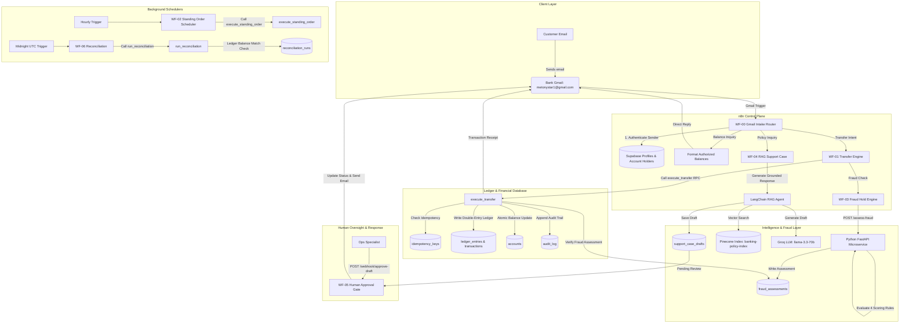

# Autonomous Digital Banking & AI Automation Platform

[](https://n8n.io/)
[](https://supabase.com/)
[](https://fastapi.tiangolo.com/)
[](https://python.langchain.com/)
[](https://www.pinecone.io/)
[](https://groq.com/)

> **An event-driven, production-grade automated digital banking control plane.**  
> Processes real customer email inquiries, executes zero-trust double-entry financial transactions via strict PostgreSQL database RPCs, computes real-time fraud risk scores via a dedicated FastAPI microservice, and grounds customer support inquiries using RAG with mandatory human operator approval gates.

---

## 🏛️ Executive Summary

Modern banking demands seamless email interaction without sacrificing financial integrity or regulatory security. This project implements a **zero-trust automated core banking platform** where **n8n Cloud** acts as the orchestration control plane, **Supabase PostgreSQL** enforces immutable transactional ledger logic, a **Python FastAPI service** evaluates deterministic fraud risk scores, and a **LangChain RAG pipeline (Groq + Pinecone + Gemini)** drafts policy support responses.

### 🔑 Core Architectural Philosophy
1. **Zero-Trust Money Movement**: AI and n8n *never* mutate account balances or insert ledger lines directly. All financial transactions, balance checks, holds, and idempotency validations are strictly encapsulated inside atomic PostgreSQL `SECURITY DEFINER` functions (RPCs).
2. **Deterministic Fraud Boundaries**: High-risk transactions trigger automated account freezes before ledger execution based on velocity, amount, and recipient history.
3. **Human-in-the-Loop RAG Governance**: AI support drafts generated via RAG are saved to an internal approval queue (`support_case_drafts`). No AI response reaches a customer without explicit human operator validation.

---

## 📊 Deployment & Implementation Matrix

| Component / Layer | Implementation Status | Deployment Environment | Live / Active Target |
|---|---|---|---|
| **Bank Gmail Intake** | ✅ Implemented | Live Google Workspace / Gmail | `metonystar1@gmail.com` |
| **n8n Orchestration Plane** | ✅ Implemented | n8n Cloud | 7 Core Workflows Active |
| **Financial Database & Ledger** | ✅ Implemented | Supabase Cloud PostgreSQL | 15 Tables + 11 Atomic RPCs |
| **Fraud Scoring Engine** | ✅ Implemented | Python FastAPI Microservice | `POST /assess-fraud` |
| **Policy RAG Vector Search** | ✅ Implemented | Pinecone Vector Database | Index: `banking-policy-index` (ns: `banking_policy`) |
| **LLM Support Drafting** | ✅ Implemented | Groq Cloud | `llama-3.3-70b-versatile` |
| **Text Embeddings Engine** | ✅ Implemented | Google Gemini API | `text-embedding-004` |
| **Human Approval Queue** | ✅ Implemented | n8n Webhook Gate | `POST /webhook/approve-draft` |

---

## 🏗️ End-to-End System Architecture



---

## ⚡ Core Banking & Business Rules

### 1. Atomic Double-Entry Financial Ledger
* All financial transactions create **exactly two ledger entries** (`ledger_entries`): one debit (`DEBIT`) and one credit (`CREDIT`), linked to a single transaction record (`transactions`).
* Account balances in `accounts.balance` are cached counters updated exclusively by `SECURITY DEFINER` SQL functions.
* All financial amounts are stored as **64-bit integers (`BIGINT`) representing cents** (e.g., `$50.00` = `5000` cents) to prevent floating-point rounding errors.

### 2. Idempotency Gatekeeping
* Every financial transfer requires a unique `idempotency_key`.
* `idempotency_keys` uses an atomic `INSERT ON CONFLICT DO NOTHING` design.
* Duplicate incoming requests return the stored historical execution result without re-executing money movement.

### 3. Joint Accounts & Multi-Signatory Governance
* Accounts can have multiple profile associations via `account_holders` with roles (`primary`, `joint`).
* Closure of a joint account requires explicit consent recorded in `joint_account_actions` and `joint_account_consents`. The account is locked for withdrawal and closed only when 100% of joint holders approve.

### 4. Background Reconciliation Audit
* **WF-06 Reconciliation** executes nightly at midnight UTC.
* Invokes `run_reconciliation()` RPC to verify:
  1. System-wide sum of all debits equals sum of all credits ($\sum \text{Debits} = \sum \text{Credits}$).
  2. Every account's cached `balance` matches the sum of its double-entry ledger lines.
* Any mismatch flags a discrepancy in `reconciliation_runs` and triggers an urgent notification to Operations.

---

## 🛡️ Security & Authorization Model

```
                    ┌──────────────────────────────────────────────┐
                    │               Supabase Cloud                 │
                    │                                              │
                    │   ┌──────────────────────────────────────┐   │
                    │   │    Row-Level Security (RLS) Policies │   │
                    │   └──────────────────┬───────────────────┘   │
                    │                      │                       │
                    │   ┌──────────────────▼───────────────────┐   │
                    │   │    SECURITY DEFINER Database RPCs    │   │
                    │   │    (Owned by banking_functions)      │   │
                    │   └──────────────────┬───────────────────┘   │
                    │                      │                       │
                    │   ┌──────────────────▼───────────────────┐   │
                    │   │  Immutable Financial Tables          │   │
                    │   │  (accounts, ledger_entries, audit)   │   │
                    │   └──────────────────────────────────────┘   │
                    └──────────────────────────────────────────────┘
```

* **Email Identity Verification**: Incoming customer emails to `metonystar1@gmail.com` are extracted and checked against `profiles.email`. Unregistered emails receive immediate denial notifications.
* **Account-Level Authorization**: `WF-00` queries `account_holders` to ensure the sender is an authorized owner of the account before processing balances or transfers. Unauthorized inquiries for third-party accounts are rejected instantly with zero data leakage.
* **Role-Based Access Control**:
  * `anon` / Customer JWT: Restricted by RLS to read-only access on their own records.
  * `service_role` (n8n/Python): Bypasses RLS to call trusted RPC endpoints. Cannot mutate balances or ledger tables without passing through RPC assertions.
  * `banking_functions` SQL Role: Sole owner of financial mutation procedures (`execute_transfer`, `place_account_hold`, etc.).

---

## 🕵️ Deterministic Fraud Detection Microservice

Located in [`python/main.py`](file:///c:/Users/Anas/Projects/BankingSystemHackathon/python/main.py), the Python FastAPI service evaluates transactions against four deterministic risk rules prior to database execution:

```
                  Incoming Transfer Payload
                             │
                             ▼
               ┌───────────────────────────┐
               │    FastAPI /assess-fraud   │
               └─────────────┬─────────────┘
                             │
       ┌─────────────────────┼─────────────────────┬─────────────────────┐
       ▼                     ▼                     ▼                     ▼
[Rule 1: Account Status] [Rule 2: Velocity]  [Rule 3: High Amount] [Rule 4: New Recipient]
  Frozen/Closed/Hold?    > 5 tx in 60 mins?   > $5,000.00 (500k¢)?  First time sender?
    (Score: 100)            (Score: +50)         (Score: +30)          (Score: +15)
       │                     │                     │                     │
       └─────────────────────┼─────────────────────┴─────────────────────┘
                             │
                             ▼
                     Calculate Total Risk
                   (Threshold >= 75.0 Risk)
                             │
            ┌────────────────┴────────────────┐
            ▼                                 ▼
      Score < 75.0                       Score >= 75.0
      [Approved]                       [Rejected & Frozen]
            │                                 │
     Proceed to Transfer              Call place_account_hold RPC
                                      Send Alert to Ops Team
```

Assessments are stored in `fraud_assessments` with a 10-minute TTL (`expires_at`). `execute_transfer()` verifies that a valid, approved assessment exists before committing funds.

---

## 🤖 RAG Policy Support Engine & Human Approval

For general policy inquiries (fees, limits, terms, wire rules), **WF-04** activates a LangChain RAG pipeline:

1. **Retrieval**: Queries Pinecone index `banking-policy-index` (namespace `banking_policy`) using Google Gemini embeddings (`text-embedding-004`).
2. **Grounded Generation**: Groq (`llama-3.3-70b-versatile`) synthesizes a grounded response strict to retrieved policy citations.
3. **Safety Queue**: The output is written to `support_case_drafts` with status `pending`.
4. **Human Gate (WF-05)**: An Ops specialist reviews the draft and posts approval via `/webhook/approve-draft`:
   ```json
   {
     "draft_id": "c1a8d294-81e3-4f2a-b72e-9d8a1e49b812",
     "action": "approve"
   }
   ```
5. **Dispatch**: `WF-05` updates draft status to `approved` and sends the final answer to the customer via `metonystar1@gmail.com`.

---

## 📂 Final Workflow Portfolio

| Workflow File | Name | Trigger | Key Function |
|---|---|---|---|
| [`WF-00-gmail-intake-router.json`](file:///c:/Users/Anas/Projects/BankingSystemHackathon/n8n/workflows/WF-00-gmail-intake-router.json) | Gmail Front Door Intake | Native Gmail Polling | Resolves sender email to profile, checks account authorization, routes to sub-workflows. |
| [`WF-01-transfer.json`](file:///c:/Users/Anas/Projects/BankingSystemHackathon/n8n/workflows/WF-01-transfer.json) | Transfer Engine | Webhook (`/webhook/transfer`) | Invokes fraud scoring, executes `execute_transfer` RPC, sends transaction receipt email. |
| [`WF-02-standing-order-scheduler.json`](file:///c:/Users/Anas/Projects/BankingSystemHackathon/n8n/workflows/WF-02-standing-order-scheduler.json) | Standing Orders | Cron (Hourly) | Finds due recurring transfers (`next_execution_at <= NOW()`), calls `execute_standing_order` RPC. |
| [`WF-03-fraud-hold.json`](file:///c:/Users/Anas/Projects/BankingSystemHackathon/n8n/workflows/WF-03-fraud-hold.json) | Fraud Hold Processor | Webhook (`/webhook/assess-fraud`) | Evaluates Python service response. Places full account hold via `place_account_hold` RPC if fraud detected. |
| [`WF-04-rag-support-case.json`](file:///c:/Users/Anas/Projects/BankingSystemHackathon/n8n/workflows/WF-04-rag-support-case.json) | RAG Policy Support | Webhook (`/webhook/support-case`) | Queries Pinecone policy vectors, drafts answer via Groq LLM, queues in `support_case_drafts`. |
| [`WF-05-human-approval-gmail.json`](file:///c:/Users/Anas/Projects/BankingSystemHackathon/n8n/workflows/WF-05-human-approval-gmail.json) | Human Approval Gate | Webhook (`/webhook/approve-draft`) | Gatekeeper node. Operator approves/edits draft, dispatches email reply via Bank Gmail. |
| [`WF-06-reconciliation.json`](file:///c:/Users/Anas/Projects/BankingSystemHackathon/n8n/workflows/WF-06-reconciliation.json) | Ledger Reconciliation | Cron (Midnight UTC) | Performs system-wide debit/credit integrity audit via `run_reconciliation` RPC. Alerts Ops on mismatch. |

---

## 🗄️ Database & Financial Schema Design

The system relies on 15 specialized tables in PostgreSQL ([`supabase/migrations/001_initial_banking_schema.sql`](file:///c:/Users/Anas/Projects/BankingSystemHackathon/supabase/migrations/001_initial_banking_schema.sql)):

```
                                  ┌──────────────┐
                                  │ auth.users   │
                                  └──────┬───────┘
                                         │ (1:1 Trigger)
                                  ┌──────▼───────┐
                                  │   profiles   │
                                  └──────┬───────┘
                                         │
                        ┌────────────────┴────────────────┐
                        │                                 │
              ┌─────────▼──────────┐            ┌─────────▼──────────┐
              │  account_holders   │            │   support_cases    │
              └─────────┬──────────┘            └─────────┬──────────┘
                        │                                 │
              ┌─────────▼──────────┐            ┌─────────▼──────────┐
              │      accounts      │            │support_case_drafts │
              └─────────┬──────────┘            └────────────────────┘
   ┌────────────────────┼────────────────────┬────────────────────┐
   │                    │                    │                    │
┌──▼───────────┐ ┌──────▼──────┐   ┌─────────▼──────────┐ ┌───────▼──────────┐
│ledger_entries│ │account_holds│   │  standing_orders   │ │joint_acc_actions │
└──┬───────────┘ └─────────────┘   └────────────────────┘ └───────┬──────────┘
   │                                                              │
┌──▼───────────┐                                          ┌───────▼──────────┐
│ transactions │                                          │joint_acc_consents│
└──┬───────────┘                                          └──────────────────┘
   │
┌──▼────────────────┐  ┌──────────────────┐  ┌───────────────────┐  ┌───────────┐
│ fraud_assessments │  │ idempotency_keys │  │reconciliation_runs│  │ audit_log │
└───────────────────┘  └───────────────────┘  └───────────────────┘  └───────────┘
```

---

## 🛠️ Technology Stack

* **Workflow Orchestration**: n8n Cloud (JavaScript / Node.js Engine)
* **Database & BaaS**: Supabase Cloud PostgreSQL (SQL, PL/pgSQL, RLS, PostgREST API)
* **Fraud Microservice**: Python 3.11+, FastAPI, Uvicorn, Pydantic, Supabase Python SDK
* **Vector Database**: Pinecone Cloud (`banking-policy-index`)
* **LLM Engine**: Groq Cloud (`llama-3.3-70b-versatile`)
* **Embeddings**: Google Gemini API (`text-embedding-004`)
* **Email Protocols**: Google Workspace OAuth2 (Gmail API)

---

## 📁 Repository Structure

```
BankingSystemHackathon/
├── README.md                           # Master Architecture & Operating Manual
├── Banking RAG Support Desk.json       # n8n Support Agent Export Blueprint
├── docs/                               # System Specs & Architecture Documents
│   ├── architecture.md                 # Table schemas, RPC function signatures, security matrix
│   ├── database.md                     # ER diagrams & migration documentation
│   ├── requirements.md                 # Functional & Non-Functional Specifications
│   └── security.md                     # RLS rules & cryptographic integrity specs
├── n8n/                                # Automation Control Plane
│   ├── README.md                       # Operator & Manual Execution Guide
│   ├── validate_workflows.js           # Workflow syntax & node configuration validator
│   ├── validate_workflows.py           # Python schema validator for n8n JSON exports
│   └── workflows/                      # Production Workflow Blueprints
│       ├── WF-00-gmail-intake-router.json
│       ├── WF-01-transfer.json
│       ├── WF-02-standing-order-scheduler.json
│       ├── WF-03-fraud-hold.json
│       ├── WF-04-rag-support-case.json
│       ├── WF-05-human-approval-gmail.json
│       └── WF-06-reconciliation.json
├── python/                             # Fraud Microservice Engine
│   ├── main.py                         # FastAPI service with 4-rule fraud scoring engine
│   ├── test_main.py                    # Pytest test suite for fraud rules
│   ├── Procfile                        # Cloud deployment runner (Uvicorn)
│   └── requirements.txt                # Python dependencies (FastAPI, Supabase, Uvicorn)
├── supabase/                           # Core Banking Ledger Database
│   └── migrations/
│       ├── 001_initial_banking_schema.sql # 15 Tables, double-entry triggers, 11 RPCs
│       └── 002_security_hardening.sql     # RLS policies & permission hardening
└── tests/                              # Comprehensive SQL Test Suite
    ├── seed_test_data.sql              # Test customer profiles, accounts & initial balances
    ├── phase1_smoke_tests.sql          # DB schema & constraint validation tests
    ├── test_transfer_flow.sql          # Transfer, idempotency & fraud integration tests
    └── test_concurrency.sql            # Concurrency & lock isolation test scripts
```

---

## ⚙️ Setup & Installation Guide

### 1. Supabase Database Setup
1. Create a project in [Supabase Cloud](https://supabase.com/).
2. Open the SQL Editor and execute:
   - [`supabase/migrations/001_initial_banking_schema.sql`](file:///c:/Users/Anas/Projects/BankingSystemHackathon/supabase/migrations/001_initial_banking_schema.sql)
   - [`supabase/migrations/002_security_hardening.sql`](file:///c:/Users/Anas/Projects/BankingSystemHackathon/supabase/migrations/002_security_hardening.sql)
   - [`tests/seed_test_data.sql`](file:///c:/Users/Anas/Projects/BankingSystemHackathon/tests/seed_test_data.sql)

### 2. Python Fraud Microservice Setup
```bash
cd python
python -m venv venv
# On Windows:
.\venv\Scripts\activate
# On Linux/macOS:
source venv/bin/activate

pip install -r requirements.txt
```

Create `python/.env`:
```env
SUPABASE_URL=https://your-supabase-project.supabase.co
SUPABASE_SERVICE_ROLE_KEY=your-supabase-service-role-key
PORT=8080
```

Run locally or deploy to Railway/Render:
```bash
python main.py
```

### 3. n8n Workflows Setup
1. Import all workflow JSON files from `n8n/workflows/` into your n8n Cloud workspace.
2. Set Environment Variable in n8n Settings:
   ```env
   PYTHON_SERVICE_URL=http://localhost:8080  # Or your deployed public Python microservice URL
   ```
3. Configure the required n8n Credentials:
   - `Gmail account` (`gmailOAuth2` connected to `metonystar1@gmail.com`)
   - `Supabase account` (`supabaseApi` with Supabase URL & Service Role Key)
   - `Groq account` (`groqApi` with Groq API Key)
   - `Pinecone account` (`pineconeApi` with Pinecone API Key)
   - `Google Gemini API` (`googlePalmApi` with Gemini API Key)
4. Activate the 7 workflows in n8n.

---

## 🧪 Live Demo & Judge Testing Guide

Judges and evaluators can test the live autonomous banking platform directly by sending emails from a registered test Gmail address to the official Bank Gmail:

> 📩 **Official Bank Gmail Intake Address**: `metonystar1@gmail.com`

> 💡 **Seed Test Identities** (Configured in [`tests/seed_test_data.sql`](file:///c:/Users/Anas/Projects/BankingSystemHackathon/tests/seed_test_data.sql)):
> - **Alice Testuser**: `alice@test.banking` (Primary holder of account `TEST-ALICE-001`, Balance: `$1,000.00`)
> - **Bob Testuser**: `bob@test.banking` (Primary holder of account `TEST-BOB-001`, Balance: `$500.00`)
> 
> *To run tests with your own email address:* In Supabase SQL Editor, update Alice's email to your personal email address:
> ```sql
> UPDATE profiles SET email = 'your.email@gmail.com' WHERE id = 'a0000000-0000-0000-0000-000000000001';
> ```

---

### 📩 Test Scenarios & Sample Emails

#### Scenario 1: Account Balance Inquiry
* **Send To**: `metonystar1@gmail.com`
* **Subject**: `Account Balance Inquiry`
* **Body**:
  ```text
  Hello, please provide my current checking account balance details.
  ```
* **Expected Response**: Receives an email listing authorized account `TEST-ALICE-001` with an accurate `$1,000.00 USD` available balance.

---

#### Scenario 2: Instant Atomic Transfer
* **Send To**: `metonystar1@gmail.com`
* **Subject**: `Send Money`
* **Body**:
  ```text
  Please transfer 50 dollars to account TEST-BOB-001.
  ```
* **System Execution**:
  1. `WF-00` parses intent, amount ($50.00 = 5000 cents), and recipient `TEST-BOB-001`.
  2. Invokes `WF-01 Transfer` → calls Python Fraud Service `POST /assess-fraud`.
  3. Fraud Engine approves (Score: Low Risk).
  4. Calls `execute_transfer` RPC → debits Alice `$50.00`, credits Bob `$50.00`, writes 2 ledger entries atomically.
* **Expected Response**: Receives a transaction confirmation email with Transaction ID and updated balance (`$950.00 USD`).

---

#### Scenario 3: High-Risk Fraud Detection & Account Freeze
* **Send To**: `metonystar1@gmail.com`
* **Subject**: `Urgent Large Transfer`
* **Body**:
  ```text
  Please transfer 6000 dollars to account TEST-BOB-001.
  ```
* **System Execution**:
  1. Transfer amount `$6,000.00` exceeds the `$5,000.00` threshold rule.
  2. Python microservice flags `Large amount ($6,000.00 exceeds $5,000.00 threshold)` + `New recipient` → Risk score exceeds `75.0`.
  3. `WF-03` triggers `place_account_hold` RPC to freeze `TEST-ALICE-001` and alerts Operations.
* **Expected Response**: Customer receives a security notice that the transaction was blocked due to risk policies and the account has been placed on hold for verification.

---

#### Scenario 4: Policy Query (RAG Support Desk)
* **Send To**: `metonystar1@gmail.com`
* **Subject**: `Wire Transfer Policy Question`
* **Body**:
  ```text
  What are the daily limits and fee structures for international wire transfers?
  ```
* **System Execution**:
  1. `WF-00` routes to `WF-04 RAG Support`.
  2. LangChain searches Pinecone index `banking-policy-index` for relevant policy documentation.
  3. Groq LLM generates a grounded draft with policy citations and stores it in `support_case_drafts` with status `pending`.
  4. Human Operator executes webhook `/webhook/approve-draft` to validate the response.
* **Expected Response**: Upon human approval, `WF-05` sends the verified policy answer email to the customer.

---

#### Scenario 5: Security & Privacy Protection Check
* **Send To**: `metonystar1@gmail.com`
* **Subject**: `Inquiry about Bob`
* **Body**:
  ```text
  Hi, can you tell me the balance of account TEST-BOB-001?
  ```
* **Expected Response**: `WF-00` checks authorization against `account_holders`. Alice is not an authorized holder of `TEST-BOB-001`. The request is rejected with zero disclosure of Bob's sensitive banking details.

---

## 📌 Known Dependencies & Architectural Boundaries

1. **Email Intake Mechanism**: Intake relies on n8n's Gmail Trigger polling for unread messages.
2. **Fraud Microservice Reachability**: n8n must be able to reach `PYTHON_SERVICE_URL`. If the microservice is offline, `WF-03` defaults to a defensive safety hold.
3. **Pinecone Indexing**: RAG policy retrieval requires pre-populated vector embeddings in Pinecone (`banking-policy-index`, namespace `banking_policy`).

---

## 👨‍💻 Authors & Project Info

* **Project Title**: Autonomous Digital Banking Platform
* **Author**: Anas Niaz
* **Event / Institution**: Banking System Hackathon
* **Repository**: Private / Submission Codebase

---

*This README reflects the exact, verified code and architecture implemented across n8n workflows, PostgreSQL Supabase RPCs, and the Python FastAPI microservice.*